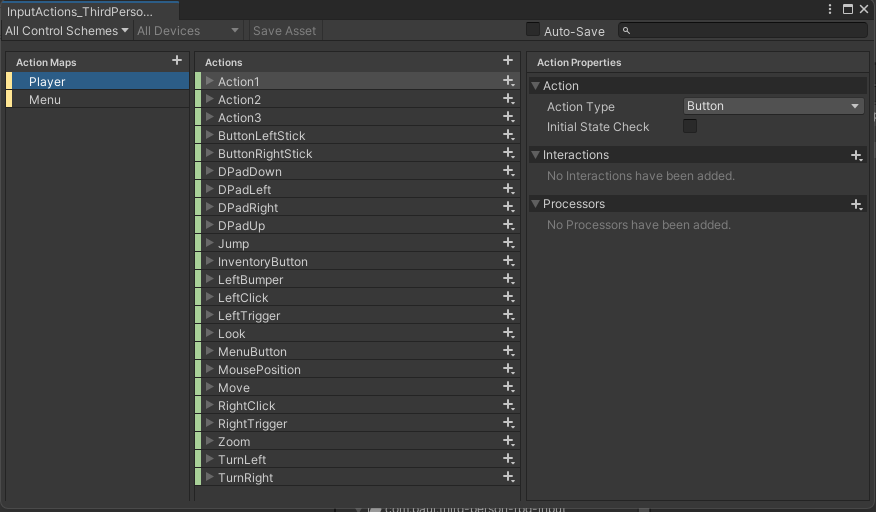
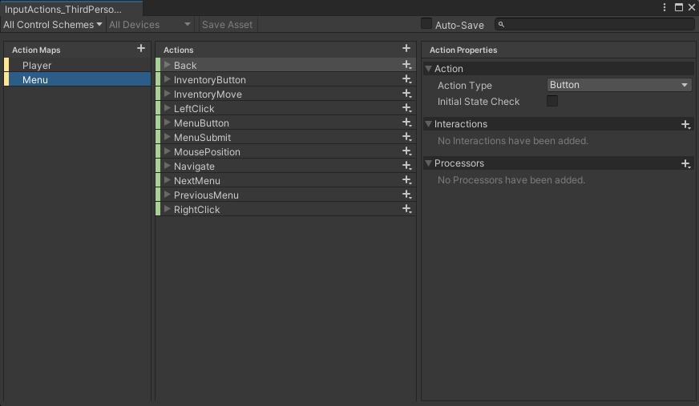
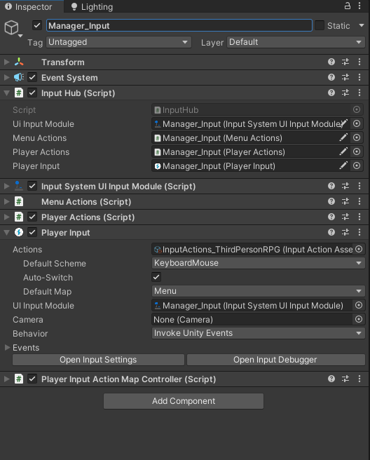

# Third Person RPG Input

## Introduction

This is a default configuration for Unity's New Input system that I use for my third person role-playing games. This implementation is designed to be used with the PlayerInput component.

This package includes InputHub.cs, which is a static class that can be read from anywhere. This simple approach works well for single player games, but will need rethinking for multiplayer or co-op implementation.

This configuration uses two control schemes: Player and Menu.

Player,

Menu,

By assigning references in PlayerInput.cs to their respective methods in InputHub.cs, we can use InputHub.Instance from anywhere to check the current state of an input action. There are two states: IsPressed and WasPressedThisFrame.

This package is actively being worked on. Demo scenes, documentation, and prefabs are comming soon!